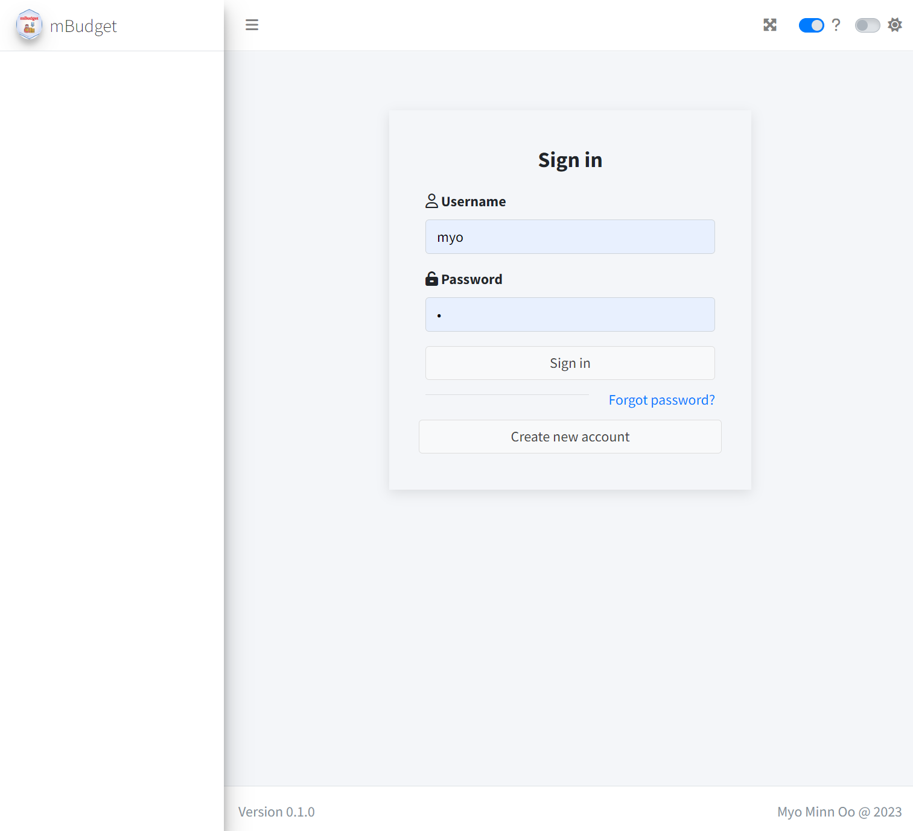

# Shiny Integration with Extended User Authentication Modules

This repository contains the material for the [R4DS Project-Club](http://r4ds.io/join): **Shiny integration with extended user authentication via [shinyAuthX](https://github.com/myominnoo/shinyAuthX)** and a demo project **[mBudget](https://github.com/myominnoo/mBudget)**

------------------------------------------------------------------------

### The Package: <https://github.com/myominnoo/shinyAuthX>

### The Presentation: [click on this link to see the presentation](https://myominnoo.github.io/shiny_integration)

### The ShinyApp: <https://myominnoo.shinyapps.io/mBudget/>

### The Video: to add later

Credits: codes and slides for github repo modified from [Federica Gazzelloni](https://github.com/Fgazzelloni)'s [Spatial Modeling with OregonFrogs](https://github.com/Fgazzelloni/spatial_modeling_with_oregonfrogs). 